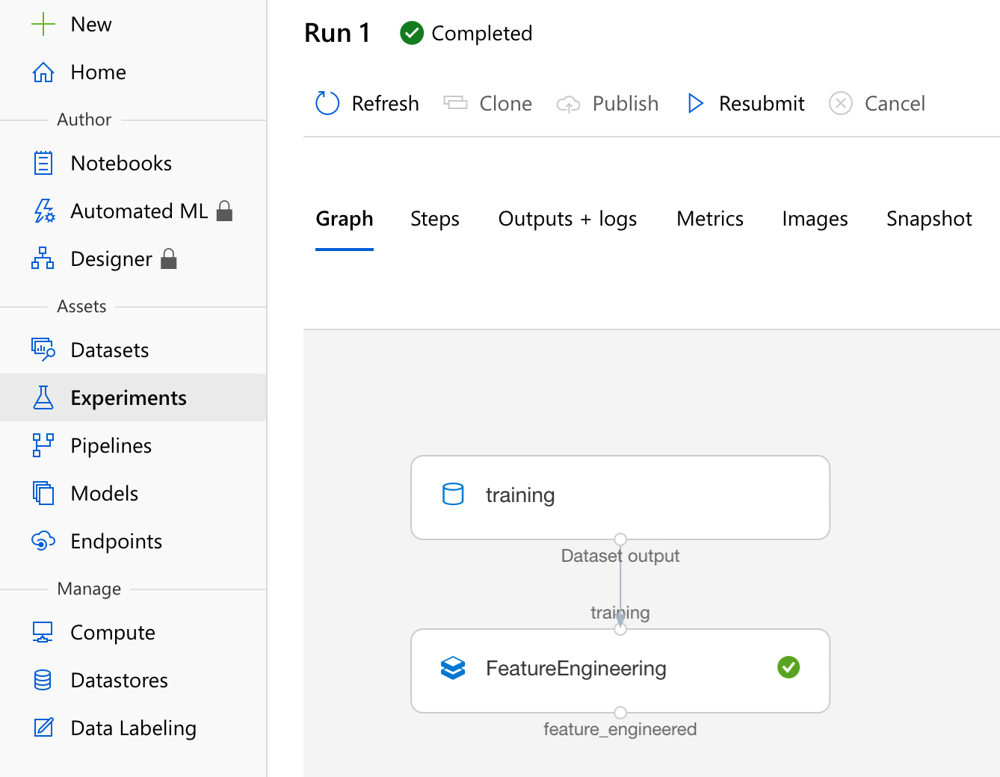
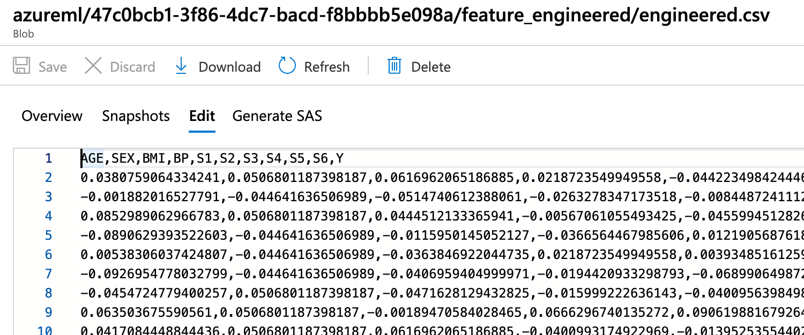

# Integrating Databricks into Azure ML Pipelines with Terraform

This samples automates the provisioning of an ML execution environment using Terraform, and the provisioning and execution of an Azure ML Pipeline that runs a Databricks notebook doing data engineering.

* Deployment of Azure ML and Databricks infrastructure using Terraform (based on the [Terraform Azure DevOps starter sample](https://github.com/microsoft/terraform-azure-devops-starter)).
* Provisioning of Databricks accounts and notebooks with Azure AD authentication, using the [databricks-client](https://pypi.org/project/databricks-client/) module.
* Unit testing of Databricks notebooks with PySpark, using the [databricks-test](https://pypi.org/project/databricks-test/) module.
* Integrating a [Databricks step](https://docs.microsoft.com/en-us/azure/machine-learning/how-to-create-your-first-pipeline#databricks) into an Azure ML pipeline.

This sample is meant to be combined with [the MLOpsPython repository](https://github.com/microsoft/MLOpsPython)
in order to add ETL / feature engineering to an ML training pipeline. The MLOpsPython repository
contains templates for subsequent steps of an MLOps pipeline, such as ML model building,
validation and scoring image deployment.

In this sample, Databricks is used for feature engineering previously to building an ML model. A Databricks step
can also be used for model training and model batch scoring.

## Contents

| File/folder             | Description                                                 |
|-------------------------|-------------------------------------------------------------|
| `README.md`             | This README file.                                           |
| `azure-pipelines.yml`   | The Azure ML build and integration pipeline.                |
| `ci_dependencies.yml`   | The image definition for the CI environment.                |
| `code`                  | The Databricks feature engineering notebook and unit tests. |
| `docs`                  | Images for this README file.                                |
| `environment_setup`     | Pipelines and configuration for building the environment.   |
| `ml_service`            | Python script for provisioning the Azure environment.       |
| `tox.ini`               | Linting and unit test configuration.                        |

## Running the sample

### Getting the code

Fork this repository within GitHub, or clone it into your Azure DevOps project.

### Create an Azure DevOps organization

We use Azure DevOps for running our MLOps pipeline with build (CI), ML training and scoring service release
(CD) stages. If you don't already have an Azure DevOps organization, create one by
following the instructions [here](https://docs.microsoft.com/en-us/azure/devops/organizations/accounts/create-organization?view=azure-devops).

If you already have an Azure DevOps organization, create a [new project](https://docs.microsoft.com/en-us/azure/devops/organizations/projects/create-project?view=azure-devops).

### Create an ARM service connection for Terraform

The `DataOpsML ARM Connection` service connection is used by the [Azure DevOps pipeline](environment_setup/terraform-init-template.yml) to creates the Azure ML workspace and associated resources through Terraform. The pipeline requires an **Azure Resource Manager**
[service connection](https://docs.microsoft.com/en-us/azure/devops/pipelines/library/service-endpoints?view=azure-devops&tabs=yaml#create-a-service-connection).

Leave the **``Resource Group``** field empty.

**Note:** Creating the ARM service connection scope requires 'Owner' or 'User Access Administrator' permissions on the subscription.
You must also have sufficient permissions to register an application with
your Azure AD tenant, or receive the ID and secret of a service principal
from your Azure AD Administrator. That principal must have 'Contributor'
permissions on the subscription.

### Create a storage account for the Terraform state

Create an Azure storage account. In the storage account, create a storage container named `terraformstate`.

### Create a Variable Group for your Pipeline

We make use of a variable group inside Azure DevOps to store variables and their
values that we want to make available across multiple pipelines or pipeline stages. You can either
store the values directly in [Azure DevOps](https://docs.microsoft.com/en-us/azure/devops/pipelines/library/variable-groups?view=azure-devops&tabs=designer#create-a-variable-group)
or connect to an Azure Key Vault in your subscription. Please refer to the
documentation [here](https://docs.microsoft.com/en-us/azure/devops/pipelines/library/variable-groups?view=azure-devops&tabs=designer#create-a-variable-group) to
learn more about how to create a variable group and
[link](https://docs.microsoft.com/en-us/azure/devops/pipelines/library/variable-groups?view=azure-devops&tabs=designer#use-a-variable-group) it to your pipeline.
Click on **Library** in the **Pipelines** section as indicated below:

Create a variable group named **``terraform``**. The YAML pipeline definitions in this repository refer to this variable group by name.

The variable group should contain the following required variables:

| Variable Name             | Suggested Value                                                       |
| ------------------------- | --------------------------------------------------------              |
| BASE_NAME                 | mydataops                                                             |
| LOCATION                  | [The [region of your Azure DevOps organization](https://docs.microsoft.com/en-us/azure/devops/organizations/accounts/change-organization-location?view=azure-devops), e.g. `westus2`] |
| TERRAFORM_BACKEND_STORAGE | [The name of the storage account you created for the Terraform state] |
| TERRAFORM_BACKEND_RG      | [The resource group of the Terraform state storage account]           |

**Note:**

The **BASE_NAME** parameter is used throughout the solution for naming
Azure resources. When the solution is used in a shared subscription, there can
be naming collisions with resources that require unique names like azure blob
storage and registry DNS naming. Make sure to give a unique value to the
BASE_NAME variable (e.g. mydataops), so that the created resources will have
unique names. The length of
the BASE_NAME value should not exceed 10 characters and it should contain numbers and lowercase letters only.

Make sure to select the **Allow access to all pipelines** checkbox in the
variable group configuration.

### Run the Terraform pipeline

In your [Azure DevOps](https://dev.azure.com) project create a new build
pipeline referring to the
[environment_setup/terraform-pipeline.yml](../environment_setup/terraform-pipeline.yml)
pipeline definition in your forked repository.

Save and run the pipeline. This will deploy the environment using Terraform, including an Azure ML Workspace.

**Note:**

The Terraform pipeline only runs Terraform if it is run on the `master` branch.
If running from another branch, set the variable `RUN_FLAG_TERRAFORM` to the
value `true` at queue time.

### Create a Registry Service Connection

[Create a service connection](https://docs.microsoft.com/en-us/azure/devops/pipelines/library/service-endpoints?view=azure-devops&tabs=yaml#sep-docreg) to your Azure Container Registry:
- As *Connection type*, select *Docker Registry*
- As *Registry type*, select *Azure Container Registry*
- As *Azure container registry*, select your Container registry instance (deployed by Terraform)
- As *Service connection name*, enter `DataOpsML Azure Container Registry`

### Create a container build pipeline

In your [Azure DevOps](https://dev.azure.com) project create a new build
pipeline referring to the
[environment_setup/docker-image-pipeline.yml](../environment_setup/docker-image-pipeline.yml)
pipeline definition in your forked repository.

Save and run the pipeline. This will build and push a container image to your Azure Container Registry.

### Create an Azure DevOps Azure ML Workspace Service Connection

Install the **Azure Machine Learning** extension to your organization from the
[marketplace](https://marketplace.visualstudio.com/items?itemName=ms-air-aiagility.vss-services-azureml),
so that you can set up a service connection to your AML workspace.

Create a service connection to your ML workspace via the [Azure DevOps Azure ML task instructions](https://marketplace.visualstudio.com/items?itemName=ms-air-aiagility.vss-services-azureml) to be able to execute the Azure ML training pipeline. Name the connection `DataOpsML Azure ML Workspace` (this name is used in the variable `WORKSPACE_SVC_CONNECTION` in [azure-pipelines.yml](azure-pipeline.yml)).

**Note:** Creating service connection with Azure Machine Learning workspace scope requires 'Owner' or 'User Access Administrator' permissions on the Workspace.
You must also have sufficient permissions to register an application with
your Azure AD tenant, or receive the ID and secret of a service principal
from your Azure AD Administrator. That principal must have Contributor
permissions on the Azure ML Workspace.

### Set up MLOps Pipeline

Now that you have all the required resources created from the IaC pipeline,
you can set up the Azure DeveOps pipeline that will run the Azure ML pipeline.

### Set up the Pipeline

In your [Azure DevOps](https://dev.azure.com) project create and run a new build
pipeline referring to the
[azure-pipelines.yml](azure-pipeline.yml)
pipeline definition in your forked repository.

After the pipeline has run, you can navigate in the Azure Portal to the Azure ML Workspace
and visualize the Azure ML pipeline result.

The pipeline output shows a reference to the storage account location where the output
data is stored. You can navigate to that dataset in the Azure Portal.

